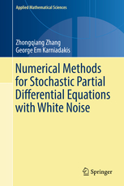

# Springer Source Code

This repository accompanies [*Numerical Methods for Stochastic Partial Differential Equations with White Noise*]
(http://www.springer.com/us/book/9783319575100) by Zhongqiang Zhang and George Em Karniadakis (Springer, 2017).

Download the files as a zip using the green button, or clone the repository to your machine using Git.

## Releases

Release v1.0 corresponds to the code in the published book, without corrections or updates.

## Corrections

For corrections to the content in the published book, see the file errata.md.

## Contributions

See the file Contributing.md for more information on how you can contribute to this repository.
